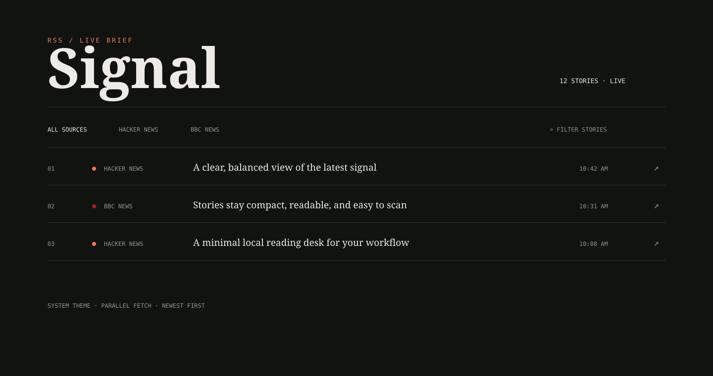

# Signal RSS Dashboard



Signal is a fast, minimalist local dashboard for the **RSS Feed Aggregator** n8n workflow. It reads the latest stories from Hacker News and BBC News, removes duplicate links, sorts by publication time, and shows the six newest stories from each source.

## Features

- 12-story balanced view: 6 Hacker News + 6 BBC News
- Parallel RSS fetching for faster refreshes
- Immediate rendering from the local feed cache when available
- Search and source filters
- Hacker News-style keyboard-accessible list rows
- Automatic light/dark mode based on system preferences
- Zero frontend dependencies; Node.js standard library backend

## Run locally

Requirements: Node.js 18 or newer.

```powershell
cd rss-feed-aggregator-fast
node server.js
```

Open [http://localhost:3001](http://localhost:3001).

The dashboard refreshes feeds in the background at startup. Select **Refresh** to fetch manually.

## API

- `GET /api/feeds` — returns feed metadata, stories, timestamps, and errors
- `POST /api/refresh` — fetches both feeds and returns the latest result

## Source workflow

The source n8n workflow is documented in [docs/workflow.md](docs/workflow.md). The dashboard is a local browser presentation layer for that workflow; it does not require an n8n server to run.

## Project status

Release `v1.0.0` — local single-user dashboard.

See [ABOUT.md](ABOUT.md), [CHANGELOG.md](CHANGELOG.md), and [docs/architecture.md](docs/architecture.md) for more detail.
